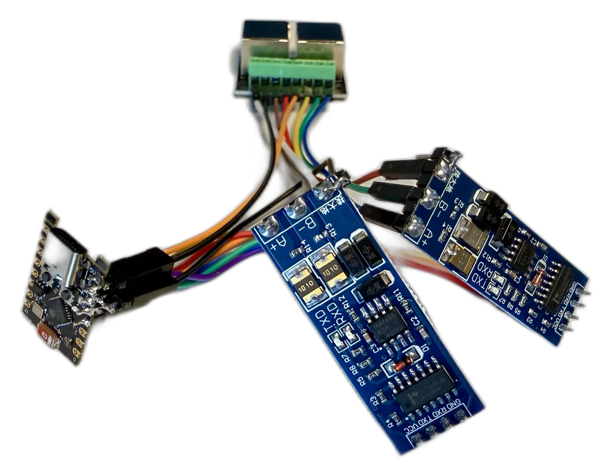

# Danfoss Icon → Home Assistant (ESPHome)

An **ESPHome drop-in replacement for the Danfoss Icon App Module (088U1101)**. A small ESP32
node plugs into the **App** port on the Icon controller, speaks the controller's
native wired protocol directly, and exposes every room to **Home Assistant** — **no Danfoss cloud,
no account, no internet dependency**.

## How it works

```text
┌─────────────┐          ┌──────────────────┐          ┌────────────────┐
│ Thermostats │<────────>│ Icon controller  │<════════>│ ESP32 node     │
│ (per room)  │  sub-GHz │ 088U1141         │  RS-485  │ (this project) │
└─────────────┘          │ owns all state   │          │ replaces the   │
                         └──────────────────┘          │ App Module     │
                                                       └───────┬────────┘
                                               Wi-Fi / Thread  │
                                                               ▼
                                                        Home Assistant
```

The Icon controller owns all room state (it gathers temperatures and setpoints from the thermostats
over its own sub-GHz mesh). The real App Module is just a **client** that polls the controller for
that state and pushes user changes back. This project does exactly the same thing: it polls the
controller over the RS-485 link, mirrors each room into an ESPHome `climate` entity, and writes
changes back when you adjust something in Home Assistant. It reaches Home Assistant over the
native ESPHome API on whatever connectivity the ESP32 provides — **Wi-Fi** on most boards, or
**Thread/802.15.4** on the radios that support it.

Because the controller is a **passive responder** — it answers valid requests and otherwise runs
completely standalone — adding this node is **low-risk**: the heating system keeps working with
or without it, and there is no pairing or seeding step. At boot the node simply starts polling —
and switches any room running the controller's built-in schedule back to **manual mode**, so Home
Assistant owns the setpoint (the default; it can be turned off).

## Features

- **Per-room `climate` entity** — current temperature, target setpoint, mode, and action
- **Setpoint writes** from Home Assistant, range-clamped to each room's configured limits
- **Floor-heating aware** — tracks the room's regulation sensor (air / floor / dual) per room
- **Per-room diagnostics** — battery level, thermostat model & firmware, assigned actuator output
  channels, and fault (e.g. thermostat missing, floor-sensor short / disconnected)
- **Per-controller diagnostics** — firmware / hardware / software versions and fault (e.g. radio
  module missing, output error, a linked controller missing); the primary also reports serial and
  link status
- **Fault rollup** — a Home Assistant "problem" alarm on every room and controller, ready for area
  cards and automations
- **Multi-controller** — a primary plus up to two linked secondary controllers (45 rooms total)
- **Home Assistant sub-devices** — each room can group as its own device, area-assignable
- **Auto-discovery helper** — a button that logs a ready-to-paste config block for your system

## Hardware at a glance

<p align="center"></p>

- An **ESP32-C3** dev board (any ESP32 with a spare hardware UART works)
- **Two** half-duplex auto-direction RS-485 transceiver modules (used as a full-duplex pair)
- An RJ45 breakout + patch cable to the controller's **App** port

Full bill of materials, pinout, wiring, and power-safety notes: **[docs/HARDWARE.md](docs/HARDWARE.md)**.

## Quick start

1. Build the hardware — **[docs/HARDWARE.md](docs/HARDWARE.md)**
2. Flash and configure ESPHome — **[docs/INSTALL.md](docs/INSTALL.md)**
3. The rooms appear in Home Assistant as climate entities

## Compatibility

Works with the **Danfoss Icon** controller (**088U1141**) that has the **App** port
(where the App Module plugs in). This project replaces the **App Module
(088U1101)** only — the separate **Zigbee Module (088U1130)** is unrelated and out of scope.

> This is **not** the newer "Icon 2" generation. It targets the original Icon controller with the
> **App** port.

## How it was reverse-engineered

The protocol was worked out from the author's own hardware — Danfoss publishes no protocol spec:

- **Traced the PCB** — from datasheets and copper tracing, mapped the RS-485 transceiver, the
  MCU's UART pins, the SPI flash, and the bootloader test points — the groundwork for both the
  capture tap and the firmware dump.
- **Captured the link** — tapped the App Module's UART (the clean TTL side of its RS-485
  transceiver, carrying the controller ↔ App Module traffic) with a logic analyzer and decoded the
  frames (sync, length, CRC-16/MODBUS, the read/write command set).
- **Decompiled the Danfoss Icon app** — it speaks the same attribute model as the wire, so it
  mapped the numeric attribute IDs to human-readable names and, just as usefully, told the story of
  *which* attributes actually matter and how they're encoded — temperatures, setpoints, modes,
  battery, schedules, fault codes — focusing the effort on the relevant handful rather than the
  full attribute space.
- **Dumped the firmware** — read the App Module's CC3200 image out over its UART ROM bootloader,
  and recovered the controller's own firmware from the App Module's flash, where it's staged to
  OTA-update the controller.
- **Confirmed it in Ghidra** — analysed both firmware images to pin down the attribute table,
  value sizes, topology, and fault-bit encodings, then cross-checked everything against the live
  captures.
- **Cross-referenced Danfoss's published Zigbee API** — Danfoss's separate Zigbee Module exposes the
  same underlying attributes onto a Zigbee mesh, and its published API documentation gave
  authoritative names for the status and fault codes (the decoded fault text comes straight from its
  room/system status-code tables) and confirmed the attribute meanings.

The reverse-engineering tooling, firmware dumps, and notes are kept locally and aren't part of
this repository.

## Documentation

| Doc | What |
| --- | --- |
| **[docs/HARDWARE.md](docs/HARDWARE.md)** | Bill of materials, RJ45 pinout, wiring, and power safety |
| **[docs/INSTALL.md](docs/INSTALL.md)** | Flashing, configuration, bring-up, and Home Assistant |
| **[docs/PROTOCOL.md](docs/PROTOCOL.md)** | The wire protocol, for the curious or for contributors |

## Safety & disclaimer

- This project is the result of **reverse-engineering hardware the author owns**. It is **not
  affiliated with, authorized by, or endorsed by Danfoss**. "Danfoss" and "Icon" are trademarks
  of their respective owners, used here only to describe compatibility.
- You connect this at your own risk. Wiring it incorrectly can damage your controller or the
  node. Read **[docs/HARDWARE.md](docs/HARDWARE.md)** — especially the power-safety section —
  before connecting anything.
- The node only **reads** state and **writes** in-range setpoints/limits. It never initiates the
  firmware-update commands the original App Module uses, and it cannot flash the controller.
- Provided **as-is, without warranty of any kind**. See [LICENSE](LICENSE).

## AI usage

AI was used extensively across this project — to help work through the protocol and to write the
ESPHome component, the host tests, and this documentation. None of it is guesswork: everything is
grounded in the reverse-engineering described above (see
[How it was reverse-engineered](#how-it-was-reverse-engineered)) and validated against real
hardware.

## License

[MIT](LICENSE).
