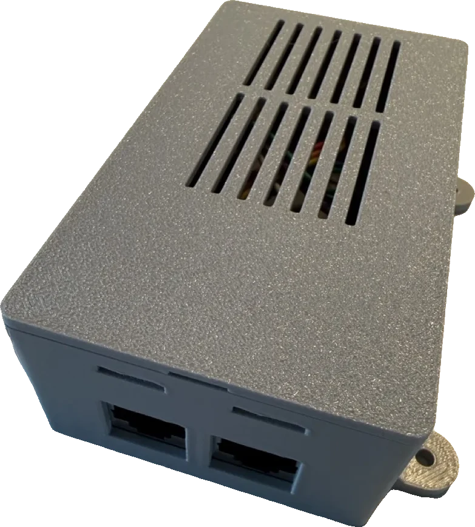
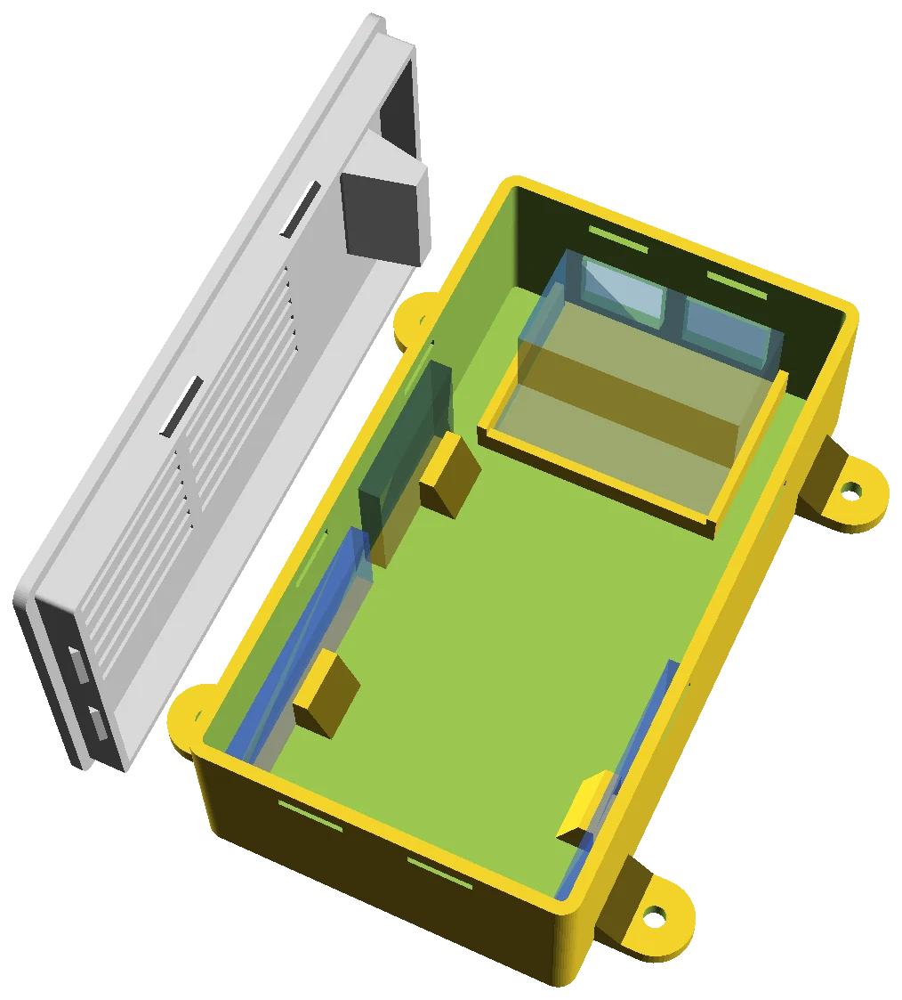
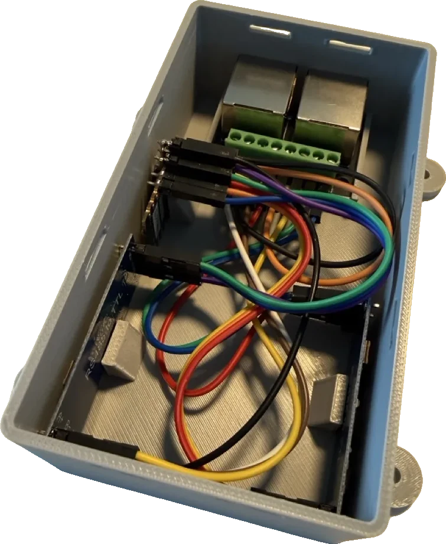
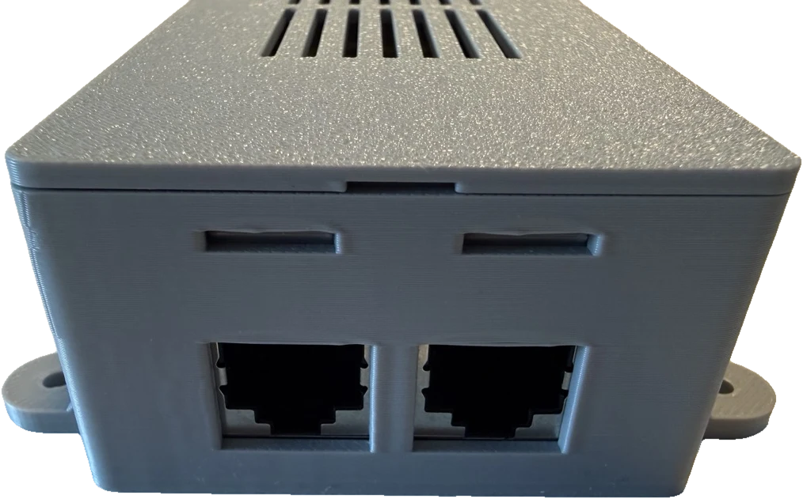

# Enclosure

A parametric, 3D-printable enclosure for the ESP32 node (see
[../docs/HARDWARE.md](../docs/HARDWARE.md)).

<table align="center"><tr>
  <td align="center" width="50%">
    <br>
    <em>The printed enclosure, closed — lid vent grille on top, RJ45 windows on the front, mounting ears on the sides.</em>
  </td>
  <td align="center" width="50%">
    <br>
    <em>How the parts sit inside (OpenSCAD render): the translucent boards are placeholders; the lid is drawn to the side to show its vent grille and RJ45 hold-down tab.</em>
  </td>
</tr></table>

> **This is the author's specific build, shared as a reference.** The model
> ([`enclosure.scad`](enclosure.scad)) is **fully parametric** — [export the STLs](#render--export)
> and print as-is if you used the same parts, or treat it as a starting point and update the
> measurements so it re-fits itself to yours.

Houses the ESP32-C3 Super Mini, both RS-485 transceiver modules, and the double RJ45 breakout,
with a **snap-fit lid** and an **RJ45 jack window**.

The three PCBs **stand on edge leaning against the long side walls** — the ESP32-C3 and one RS-485
along one wall (end-to-end), the other RS-485 along the opposite wall — pinned by small retaining
tabs (and steadied by the cable bundle) rather than full card guides; their connectors face the
central channel. There is **no USB-C
cutout** — open the lid to flash. Ventilation is a fine slot grille **in the lid** over the central
channel (heat rises out, PCBs stay out of sight).

The RJ45 breakout drops into a pocket (front wall + side ribs + a back rib); a hold-down rib on the
lid underside clamps its top edge when the lid closes, so no cable tie or fasteners are needed.

<table align="center"><tr>
  <td align="center">
    <br>
    <em>The real build, lid off — boards on edge against the long walls, RJ45 breakout in its front pocket, cable bundle down the central channel.</em>
  </td>
  <td align="center">
    <br>
    <em>Front face: the two RJ45 jack windows (and the snap slots above), bridged over during printing.</em>
  </td>
</tr></table>

Four external **mounting ears** at the base (two per long side) take M3 screws for flush surface
mounting; disable with `mount_ears = false`.

## Before you print: measure

Defaults are typical values for the common versions of these boards, **not your exact parts.**
Update every value marked `// MEASURE` in `enclosure.scad`, especially:

- ESP32-C3 & RS-485: **long edge** (runs along the wall, Y), **short edge** (= standing height),
  PCB thickness
- `conn_clear` — how far the header + seated dupont connector + wire bend stick out from one PCB
  face (~20 mm here). Two boards face inward from opposite walls, so this drives the enclosure **width**
  (`inner_x = 2 × (wall_slack + board_t_eff + conn_clear) + mid_gap`).
- RJ45 breakout: board L×W (`rj_l`/`rj_w`), the jack **window** W×H, plus `rj_jack_d` (how far
  the jack housing reaches in from the wall) and `rj_h` (floor to top of the housing) — the lid
  hold-down tab lands on the housing top using these two.

The interior footprint and height are **derived** from these, so the box resizes itself to fit.
The enclosure comes out long and narrow: length = RJ45 zone + (ESP32 + RS-485) end-to-end.

## Adapt it for your build

Different boards, a single full-duplex transceiver, extra ventilation, a USB-C cutout, a DIN-rail
clip — the model is meant to be changed. Two ways in:

- **By hand:** open [`enclosure.scad`](enclosure.scad) in OpenSCAD, edit the named variables at the top
  (start with everything marked `// MEASURE`), press F5 to preview, then re-export (below).
- **With AI:** the whole model is a single, commented, plain-text `.scad` file — a good fit for an
  AI coding assistant. Paste `enclosure.scad` in (or point a tool like Claude Code at this folder),
  describe your parts and what you want changed ("I'm using a DevKitM-1 and one SN65HVD71
  transceiver; add a USB-C cutout on the back wall"), and iterate on the variables and geometry.
  Always render and eyeball the result — and dry-fit a print — before trusting it; AI gets
  dimensions and clearances wrong.

## Render / export

```sh
# Preview with translucent board + connector placeholders (OpenSCAD GUI, F5)
openscad enclosure.scad

# Export the two print parts
openscad -o base.stl -D 'part="base";' enclosure.scad
openscad -o lid.stl  -D 'part="lid";'  enclosure.scad
```

`part` can be `"preview"` (default), `"base"`, `"lid"`, or `"both"`.

## Printing notes

- **Orientation:** print both parts flat (base floor-down, lid top-down), normally no supports.
  The front-wall openings print as **bridges** (top edge anchored both sides): the RJ45 windows are
  split by `rj_win_gap` into two ~14 mm spans, and the snap slots are ~10 mm — both bridge cleanly
  on most printers with part cooling. If yours sags on them, add supports for the **base only**
  (the scars land inside the windows, hidden by the jack). The lid snap teeth are sloped, so the
  lid itself needs no supports.
- **Material:** PLA or PETG, 3 perimeters, 20% infill.
- **Snap fit is printer-dependent.** Print the **lid first** and test the click. Too tight →
  raise `fit_clear` or lower `snap_depth`; too loose → the reverse. Teeth are placed on all
  four walls — `snap_n_short` / `snap_n_long` set how many per short/long wall (long-side teeth
  keep the long lid edges from gapping). A tiny **channel under the lid's jack-end edge**
  (`lid_grip` / `grip_w` / `grip_l` / `grip_d`), hidden from the top, lets a nail catch under the
  lip to lift it off.
- **Boards a loose/tight fit?** small retaining tabs pin each board against its wall — set the
  standoff with `esp_tab_off` / `rs_tab_off` (distance wall → tab) and size with `tab_w/t/h`; toggle
  with `board_tabs`. For the central cable room widen `mid_gap`, or tune `wall_slack` for the wall
  gap.
- **Ventilation:** `vent_w` / `vent_gap` set the lid slot pitch; set `lid_vents = false` to seal it up.
- **Mounting ears:** `mount_ears` toggles them; `mount_hole_d` sets the screw size, `mount_ext` /
  `mount_ear_w` / `mount_inset` the shape and spacing, `mount_gusset` the brace height.
